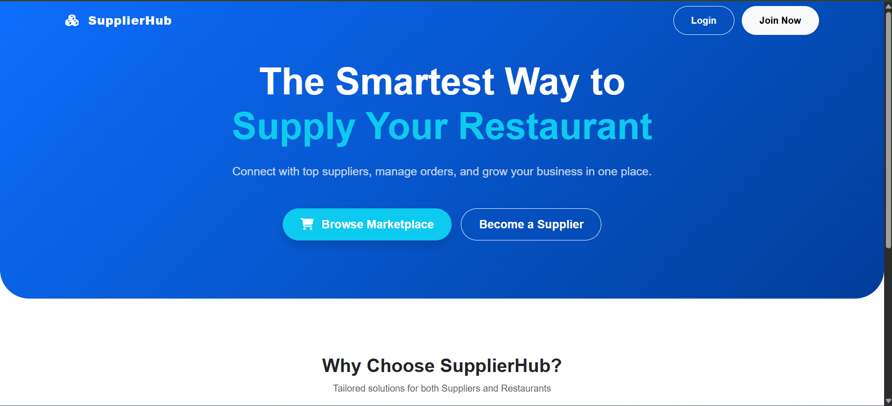
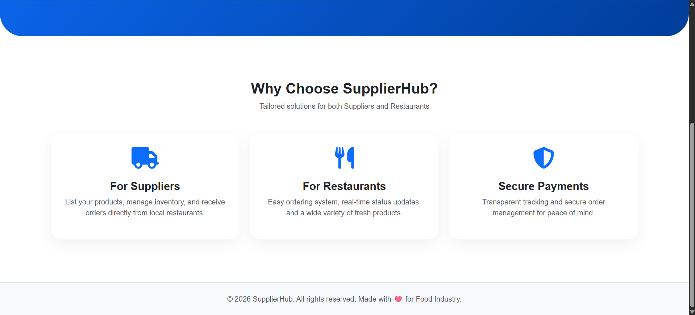
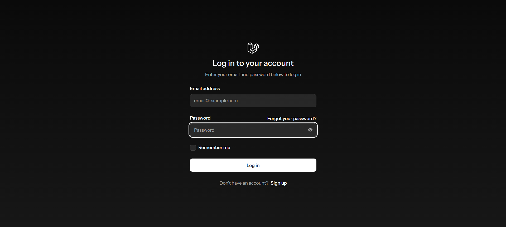
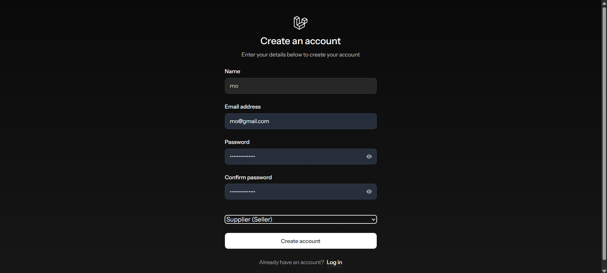
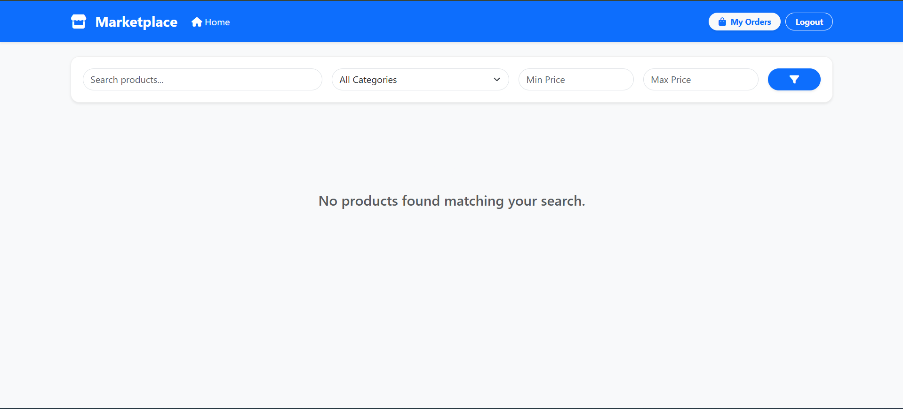
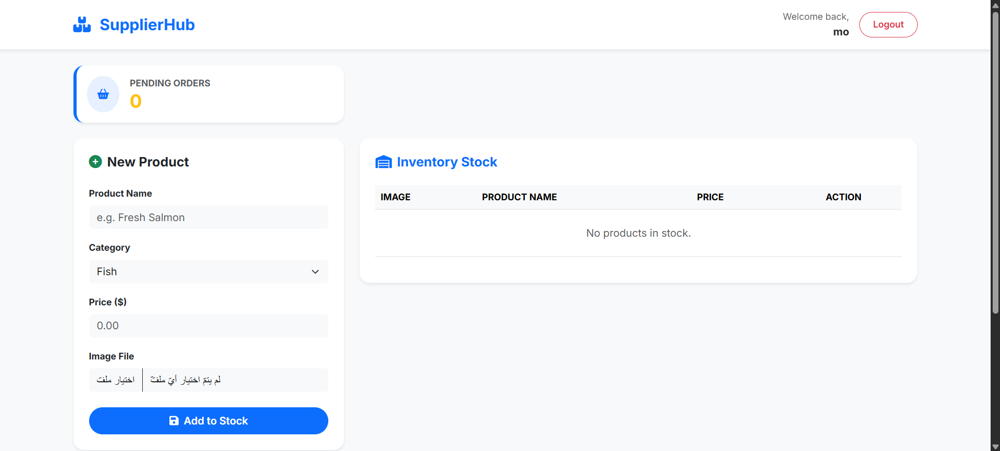
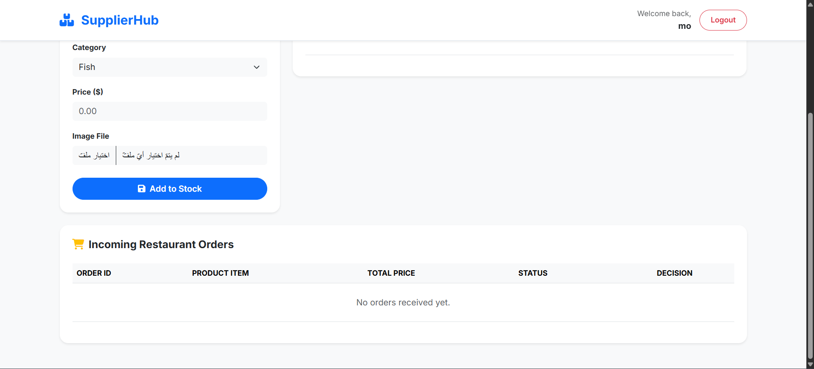
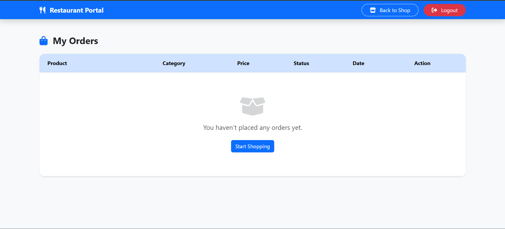

# Restaurant Ordering Platform

A fully automated system connecting restaurants and suppliers through intelligent order management.

---

## The Problem We're Solving

- **Unorganized Orders:** Phone calls and WhatsApp messages lead to forgotten, lost, or misunderstood requests that disrupt operations.  
- **Lack of Transparency:** Restaurants cannot easily track order status without making follow-up calls or sending additional messages.  
- **Poor Record Keeping:** No structured history of past orders exists for accounting, inventory tracking, or financial analysis.

---

## Our Solution

- **Unified Dashboard Platform:** Connects restaurants and suppliers in one centralized interface.  
- **Faster Order Processing:** Instant confirmation for every order.  
- **Accurate Data Tracking:** Full tracking across all transactions.  
- **Easy Order Management:** Quick management and cancellation of orders.  
- **Clear Order History:** For both restaurants and suppliers.

---

## Killer Features

### Instant Ordering
- One-click "Buy" button creates complete order records with product details, quantities, prices, and identities in seconds.

### Role-Based Security
- Laravel Middleware separates suppliers managing products from restaurants browsing and ordering.

### Real-Time Status
- Order stages (Waiting, Accepted, Rejected) updated instantly without manual confirmations or phone calls.

### Multi-Role Authorization
- **Suppliers:** Manage product catalogs, update inventory, process incoming orders.  
- **Restaurants:** Browse products, compare prices, place orders with full transparency.

---

## Technical Excellence

1. **Mass Assignment Protection:** Models protected using Laravel `fillable` properties.  
2. **Eloquent Relationships:** Efficient data retrieval with ORM relationships (`belongsTo`, `hasMany`).  
3. **Optimized UX/UI:** Flash messages, quick action buttons (Buy/Cancel), clear status indicators.

---

## Challenges Solved

- **Database Default Value Issue:** Handled missing quantity values in orders.  
- **Fast Order Cancellation:** Allows restaurants to cancel orders instantly before supplier processing.

---

## Future Vision

- **Online Payment Integration**  
- **AI-Powered Analytics**  
- **Real-Time Notifications**  
- **Inventory Management**  

> Transforming the Restaurant Supply Chain: From manual calls to intelligent automation — revolutionizing how restaurants and suppliers do business.

---

## Getting Started (Local Setup)

1. Clone the repository:

git clone https://github.com/Mo7amed-Aboelsoud/SupplierHub.git
cd SupplierHub

2.Install dependencies:

   composer install

3.Setup environment:

  cp .env.example .env
  php artisan key:generate

4.Run migrations:
 
   php artisan migrate

5.Start the development server:

   php artisan serve

6.Open your browser:

  http://127.0.0.1:8000

========================
Technologies Used :-

  1- PHP, Laravel

  2- SQLite / MySQL

  3- HTML, CSS, JavaScript

  4- Git & GitHub

=============
Screenshots :-

### Home Page

### Log In

### register

### Order Page

### Supplier Dashboard

### Restaurant Dashboard

